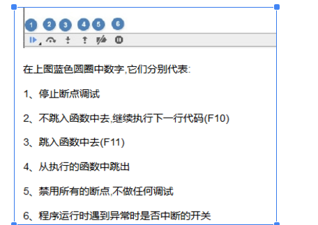
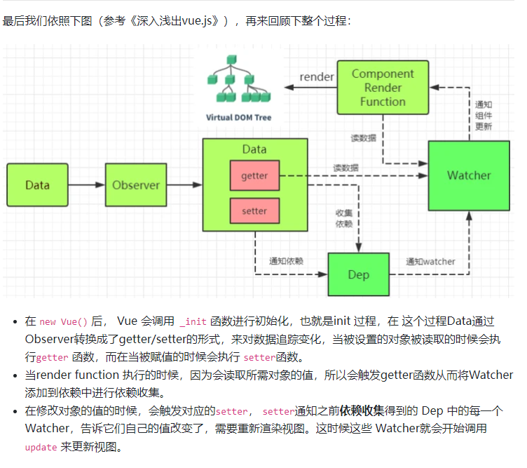
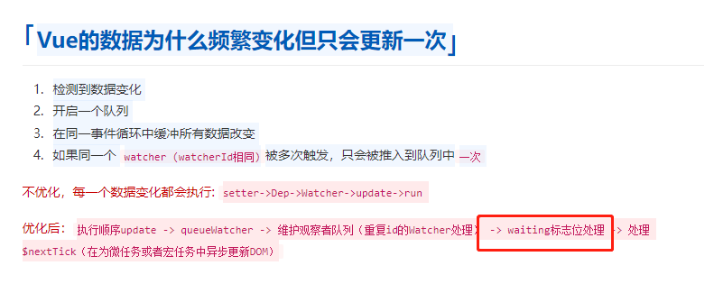

# Vue2 源码解读
## 准备
>现在最新的 Vue 2 的版本号是 2.6.12，所以我就以当前版本的代码进行分析和学习。[vue源码地址](https://github.com/vuejs/vue)
* 下载 Vue 源码
  
  执行 npm i 安装依赖，待装到端到端测试工具时可直接 ctrl + c 掉，不影响后续源码的研读。

* source map
  
  在 package.json -> scripts 中的 dev 命令中添加 --sourcemap，这样就可以在浏览器中调试源码时查看当前代码在源码中的位置。

  ```js
  {
    "scripts": {
      "dev": "rollup -w -c scripts/config.js --sourcemap --environment TARGET:web-full-dev"
    }
  }
  ```

### Vue源码中examples创建html进行Vue源码调试
[examples例子](http://172.16.0.99:5500/vue-dev/examples/debug/index.html)


### 谷歌调试说明


## 1.Vue初始化过程
[Vue初始化过程](https://juejin.cn/post/6950084496515399717)

## 2.响应式原理

[响应式原理](https://juejin.cn/post/6950826293923414047)
[Vue响应式原理](https://zhuanlan.zhihu.com/p/88648401)

## 3.异步更新


[watcher的异步更新](https://blog.csdn.net/ajh99990/article/details/100355011)

[异步更新](https://juejin.cn/post/6951568091893465102)

## 4.全局 API
[全局 API](https://juejin.cn/post/6952643167715852319)

## 5.实例方法
[实例方法](https://juejin.cn/post/6953503236254859294)

## 6. Hook Event
[Hook Event](https://juejin.cn/post/6954923081462710309)

## 7. 编译器 之 解析
[编译器 之 解析](https://juejin.cn/post/6959019076983209992)

## 8. 编译器 之 优化
[编译器 之 优化](https://juejin.cn/post/6960465810682806308)

## 9. 编译器 之 生成渲染函数
[编译器 之 生成渲染函数](https://juejin.cn/post/6961545472204865572)

## 10. render helper
[render helper](https://juejin.cn/post/6963048982079602696)

## 11. patch
[patch](https://juejin.cn/post/6964141635856760868)


