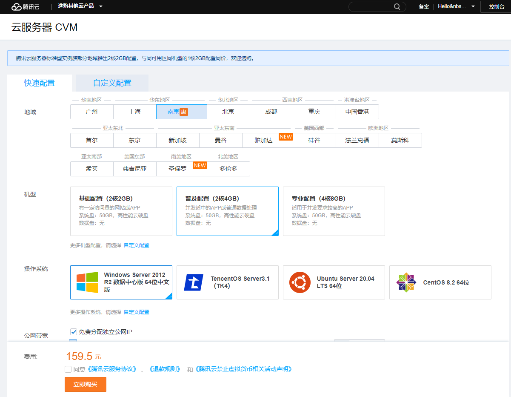
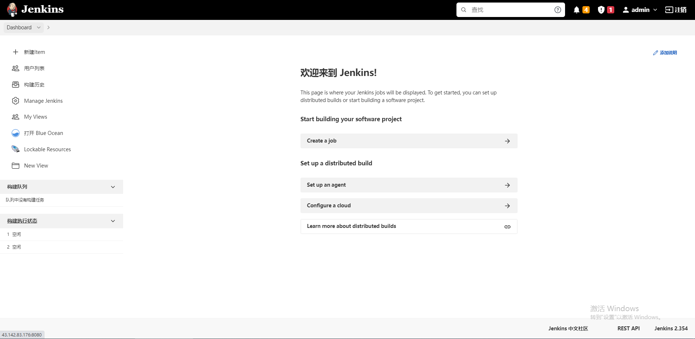

# ecs

## 1.云服务器ECS(Elastic Compute Service) || CVM(Cloud Virtual Machine)

### 1.1 购买相关的云服务器

* [腾讯云](https://buy.cloud.tencent.com/cvm)
* [阿里云](https://www.aliyun.com/product/ecs)
* [华为云](https://www.huaweicloud.com/product/ecs.html)

> 💡**以下以腾讯云为例**

#### 1.1 选择相应的服务器配置进行购买
<div style="text-align: center;">
  
</div>

#### 1.2 腾讯云后台管理服务器实例

* 注意事项：开启防火墙，默认可访问端口
* HTTP(80)
* HTTPS(443)
* Linux登录(22)
* Windows登录(3389)
* 如需其他端口可访问需自行添加

[腾讯云管理后台](https://console.cloud.tencent.com/lighthouse/instance/index)
  
<div style="text-align: center;">
  
</div>

#### 1.3 下载Xshell、xftp工具

链接远程服务器、远程控制终端，ecs需要开启相应的端口(22)开放。

[Xshell下载](https://xshell.en.softonic.com/download)

[如何使用Xshell连接腾讯云服务器](https://cloud.tencent.com/developer/article/1688834?ivk_sa=1024320u)

<div style="text-align: center;">
  
</div>

## 2.搭建nginx服务，静态资源服务器

### nginx简介

Nginx是一个高性能的HTTP反向代理服务器。特点是占用内存少，并发能力强。实际上Nginx的并发能力是同类的网页服务器中最好的。通过配置 Nginx 配置文件，实现正向代理、反向代理、负载均衡、Nginx 缓存、动静分离和高可用 Nginx 6种功能。

※ 🔺 常用的web服务器有：1.apache；2.Lighttpd；3.Tomcat；4.IBM WebSphere；5.IIS；6.Nginx

[从原理到实战，彻底搞懂Nginx](https://juejin.cn/post/6844904046789132301)

[Nginx与前端开发](https://juejin.cn/post/6844903684967825421)

### 2.1 下载安装启动nginx

[腾讯云CentOS安装 Nginx](https://blog.51cto.com/u_11990719/3113865)

### 2.2 nginx配置说明

Nginx的主配置文件是nginx.conf，这个配置文件一共由三部分组成，分别为全局块、events块和http块。在http块中，又包含http全局块、多个server块。每个server块中，可以包含server全局块和多个location块。在同一配置块中嵌套的配置块，各个之间不存在次序关系。

[Nginx配置详解](https://blog.csdn.net/SELF_REDEEM/article/details/119299510)

[Nginx 修饰符 Location 详解](https://www.cnblogs.com/yxhblogs/p/12906046.html)

<div style="text-align: center;">
  
</div>

#### 2.2.1 全局块
> 配置影响nginx全局的指令。一般有运行nginx服务器的用户组，nginx进程pid存放路径，日志存放路径，配置文件引入，允许生成worker process数等。

#### 2.2.2 events块
> 配置影响nginx服务器或与用户的网络连接。有每个进程的最大连接数，选取哪种事件驱动模型处理连接请求，是否允许同时接受多个网路连接，开启多个网络连接序列化等。

#### 2.2.3 http块
> 可以嵌套多个server，配置代理，缓存，日志定义等绝大多数功能和第三方模块的配置。如文件引入，mime-type定义，日志自定义，是否使用sendfile传输文件，连接超时时间，单连接请求数等。

#### 2.2.4 server块
> 配置虚拟主机的相关参数，一个http中可以有多个server。

#### 2.2.5 location块
> 配置请求的路由，以及各种页面的处理情况。

```bash
######Nginx配置文件nginx.conf中文详解#####

#定义Nginx运行的用户和用户组
user www www;

#nginx进程数，建议设置为等于CPU总核心数。
worker_processes 8;
 
#全局错误日志定义类型，[ debug | info | notice | warn | error | crit ]
error_log /usr/local/nginx/logs/error.log info;

#进程pid文件
pid /usr/local/nginx/logs/nginx.pid;

#指定进程可以打开的最大描述符：数目
#工作模式与连接数上限
#这个指令是指当一个nginx进程打开的最多文件描述符数目，理论值应该是最多打开文件数（ulimit -n）与nginx进程数相除，但是nginx分配请求并不是那么均匀，所以最好与ulimit -n 的值保持一致。
#现在在linux 2.6内核下开启文件打开数为65535，worker_rlimit_nofile就相应应该填写65535。
#这是因为nginx调度时分配请求到进程并不是那么的均衡，所以假如填写10240，总并发量达到3-4万时就有进程可能超过10240了，这时会返回502错误。
worker_rlimit_nofile 65535;


events
{
    #参考事件模型，use [ kqueue | rtsig | epoll | /dev/poll | select | poll ]; epoll模型
    #是Linux 2.6以上版本内核中的高性能网络I/O模型，linux建议epoll，如果跑在FreeBSD上面，就用kqueue模型。
    #补充说明：
    #与apache相类，nginx针对不同的操作系统，有不同的事件模型
    #A）标准事件模型
    #Select、poll属于标准事件模型，如果当前系统不存在更有效的方法，nginx会选择select或poll
    #B）高效事件模型
    #Kqueue：使用于FreeBSD 4.1+, OpenBSD 2.9+, NetBSD 2.0 和 MacOS X.使用双处理器的MacOS X系统使用kqueue可能会造成内核崩溃。
    #Epoll：使用于Linux内核2.6版本及以后的系统。
    #/dev/poll：使用于Solaris 7 11/99+，HP/UX 11.22+ (eventport)，IRIX 6.5.15+ 和 Tru64 UNIX 5.1A+。
    #Eventport：使用于Solaris 10。 为了防止出现内核崩溃的问题， 有必要安装安全补丁。
    use epoll;

    #单个进程最大连接数（最大连接数=连接数*进程数）
    #根据硬件调整，和前面工作进程配合起来用，尽量大，但是别把cpu跑到100%就行。每个进程允许的最多连接数，理论上每台nginx服务器的最大连接数为。
    worker_connections 65535;

    #keepalive超时时间。
    keepalive_timeout 60;

    #客户端请求头部的缓冲区大小。这个可以根据你的系统分页大小来设置，一般一个请求头的大小不会超过1k，不过由于一般系统分页都要大于1k，所以这里设置为分页大小。
    #分页大小可以用命令getconf PAGESIZE 取得。
    #[root@web001 ~]# getconf PAGESIZE
    #4096
    #但也有client_header_buffer_size超过4k的情况，但是client_header_buffer_size该值必须设置为“系统分页大小”的整倍数。
    client_header_buffer_size 4k;

    #这个将为打开文件指定缓存，默认是没有启用的，max指定缓存数量，建议和打开文件数一致，inactive是指经过多长时间文件没被请求后删除缓存。
    open_file_cache max=65535 inactive=60s;

    #这个是指多长时间检查一次缓存的有效信息。
    #语法:open_file_cache_valid time 默认值:open_file_cache_valid 60 使用字段:http, server, location 这个指令指定了何时需要检查open_file_cache中缓存项目的有效信息.
    open_file_cache_valid 80s;

    #open_file_cache指令中的inactive参数时间内文件的最少使用次数，如果超过这个数字，文件描述符一直是在缓存中打开的，如上例，如果有一个文件在inactive时间内一次没被使用，它将被移除。
    #语法:open_file_cache_min_uses number 默认值:open_file_cache_min_uses 1 使用字段:http, server, location  这个指令指定了在open_file_cache指令无效的参数中一定的时间范围内可以使用的最小文件数,如果使用更大的值,文件描述符在cache中总是打开状态.
    open_file_cache_min_uses 1;
    
    #语法:open_file_cache_errors on | off 默认值:open_file_cache_errors off 使用字段:http, server, location 这个指令指定是否在搜索一个文件时记录cache错误.
    open_file_cache_errors on;
}
 
 
 
#设定http服务器，利用它的反向代理功能提供负载均衡支持
http
{
    #文件扩展名与文件类型映射表
    include mime.types;

    #默认文件类型
    default_type application/octet-stream;

    #默认编码
    #charset utf-8;

    #服务器名字的hash表大小
    #保存服务器名字的hash表是由指令server_names_hash_max_size 和server_names_hash_bucket_size所控制的。参数hash bucket size总是等于hash表的大小，并且是一路处理器缓存大小的倍数。在减少了在内存中的存取次数后，使在处理器中加速查找hash表键值成为可能。如果hash bucket size等于一路处理器缓存的大小，那么在查找键的时候，最坏的情况下在内存中查找的次数为2。第一次是确定存储单元的地址，第二次是在存储单元中查找键 值。因此，如果Nginx给出需要增大hash max size 或 hash bucket size的提示，那么首要的是增大前一个参数的大小.
    server_names_hash_bucket_size 128;

    #客户端请求头部的缓冲区大小。这个可以根据你的系统分页大小来设置，一般一个请求的头部大小不会超过1k，不过由于一般系统分页都要大于1k，所以这里设置为分页大小。分页大小可以用命令getconf PAGESIZE取得。
    client_header_buffer_size 32k;

    #客户请求头缓冲大小。nginx默认会用client_header_buffer_size这个buffer来读取header值，如果header过大，它会使用large_client_header_buffers来读取。
    large_client_header_buffers 4 64k;

    #设定通过nginx上传文件的大小
    client_max_body_size 8m;

    #开启高效文件传输模式，sendfile指令指定nginx是否调用sendfile函数来输出文件，对于普通应用设为 on，如果用来进行下载等应用磁盘IO重负载应用，可设置为off，以平衡磁盘与网络I/O处理速度，降低系统的负载。注意：如果图片显示不正常把这个改成off。
    #sendfile指令指定 nginx 是否调用sendfile 函数（zero copy 方式）来输出文件，对于普通应用，必须设为on。如果用来进行下载等应用磁盘IO重负载应用，可设置为off，以平衡磁盘与网络IO处理速度，降低系统uptime。
    sendfile on;

    #开启目录列表访问，合适下载服务器，默认关闭。
    autoindex on;

    #此选项允许或禁止使用socke的TCP_CORK的选项，此选项仅在使用sendfile的时候使用
    tcp_nopush on;
     
    tcp_nodelay on;

    #长连接超时时间，单位是秒
    keepalive_timeout 120;

    #FastCGI相关参数是为了改善网站的性能：减少资源占用，提高访问速度。下面参数看字面意思都能理解。
    fastcgi_connect_timeout 300;
    fastcgi_send_timeout 300;
    fastcgi_read_timeout 300;
    fastcgi_buffer_size 64k;
    fastcgi_buffers 4 64k;
    fastcgi_busy_buffers_size 128k;
    fastcgi_temp_file_write_size 128k;

    #gzip模块设置
    gzip on; #开启gzip压缩输出
    gzip_min_length 1k;    #最小压缩文件大小
    gzip_buffers 4 16k;    #压缩缓冲区
    gzip_http_version 1.0;    #压缩版本（默认1.1，前端如果是squid2.5请使用1.0）
    gzip_comp_level 2;    #压缩等级
    gzip_types text/plain application/x-javascript text/css application/xml;    #压缩类型，默认就已经包含textml，所以下面就不用再写了，写上去也不会有问题，但是会有一个warn。
    gzip_vary on;
    #开启限制IP连接数的时候需要使用
    #limit_zone crawler $binary_remote_addr 10m;
    #负载均衡配置
    upstream jh.w3cschool.cn {
     
        #upstream的负载均衡，weight是权重，可以根据机器配置定义权重。weigth参数表示权值，权值越高被分配到的几率越大。
        server 192.168.80.121:80 weight=3;
        server 192.168.80.122:80 weight=2;
        server 192.168.80.123:80 weight=3;

        #nginx的upstream目前支持4种方式的分配
        #1、轮询（默认）
        #每个请求按时间顺序逐一分配到不同的后端服务器，如果后端服务器down掉，能自动剔除。
        #2、weight
        #指定轮询几率，weight和访问比率成正比，用于后端服务器性能不均的情况。
        #例如：
        #upstream bakend {
        #    server 192.168.0.14 weight=10;
        #    server 192.168.0.15 weight=10;
        #}
        #2、ip_hash
        #每个请求按访问ip的hash结果分配，这样每个访客固定访问一个后端服务器，可以解决session的问题。
        #例如：
        #upstream bakend {
        #    ip_hash;
        #    server 192.168.0.14:88;
        #    server 192.168.0.15:80;
        #}
        #3、fair（第三方）
        #按后端服务器的响应时间来分配请求，响应时间短的优先分配。
        #upstream backend {
        #    server server1;
        #    server server2;
        #    fair;
        #}
        #4、url_hash（第三方）
        #按访问url的hash结果来分配请求，使每个url定向到同一个后端服务器，后端服务器为缓存时比较有效。
        #例：在upstream中加入hash语句，server语句中不能写入weight等其他的参数，hash_method是使用的hash算法
        #upstream backend {
        #    server squid1:3128;
        #    server squid2:3128;
        #    hash $request_uri;
        #    hash_method crc32;
        #}

        #tips:
        #upstream bakend{#定义负载均衡设备的Ip及设备状态}{
        #    ip_hash;
        #    server 127.0.0.1:9090 down;
        #    server 127.0.0.1:8080 weight=2;
        #    server 127.0.0.1:6060;
        #    server 127.0.0.1:7070 backup;
        #}
        #在需要使用负载均衡的server中增加 proxy_pass http://bakend/;

        #每个设备的状态设置为:
        #1.down表示单前的server暂时不参与负载
        #2.weight为weight越大，负载的权重就越大。
        #3.max_fails：允许请求失败的次数默认为1.当超过最大次数时，返回proxy_next_upstream模块定义的错误
        #4.fail_timeout:max_fails次失败后，暂停的时间。
        #5.backup： 其它所有的非backup机器down或者忙的时候，请求backup机器。所以这台机器压力会最轻。

        #nginx支持同时设置多组的负载均衡，用来给不用的server来使用。
        #client_body_in_file_only设置为On 可以讲client post过来的数据记录到文件中用来做debug
        #client_body_temp_path设置记录文件的目录 可以设置最多3层目录
        #location对URL进行匹配.可以进行重定向或者进行新的代理 负载均衡
    }
     
     
     
    #虚拟主机的配置
    server
    {
        #监听端口
        listen 80;

        #域名可以有多个，用空格隔开
        server_name www.w3cschool.cn w3cschool.cn;
        index index.html index.htm index.php;
        root /data/www/w3cschool;

        #对******进行负载均衡
        location ~ .*.(php|php5)?$
        {
            fastcgi_pass 127.0.0.1:9000;
            fastcgi_index index.php;
            include fastcgi.conf;
        }
         
        #图片缓存时间设置
        location ~ .*.(gif|jpg|jpeg|png|bmp|swf)$
        {
            expires 10d;
        }
         
        #JS和CSS缓存时间设置
        location ~ .*.(js|css)?$
        {
            expires 1h;
        }
         
        #日志格式设定
        #$remote_addr与$http_x_forwarded_for用以记录客户端的ip地址；
        #$remote_user：用来记录客户端用户名称；
        #$time_local： 用来记录访问时间与时区；
        #$request： 用来记录请求的url与http协议；
        #$status： 用来记录请求状态；成功是200，
        #$body_bytes_sent ：记录发送给客户端文件主体内容大小；
        #$http_referer：用来记录从那个页面链接访问过来的；
        #$http_user_agent：记录客户浏览器的相关信息；
        #通常web服务器放在反向代理的后面，这样就不能获取到客户的IP地址了，通过$remote_add拿到的IP地址是反向代理服务器的iP地址。反向代理服务器在转发请求的http头信息中，可以增加x_forwarded_for信息，用以记录原有客户端的IP地址和原来客户端的请求的服务器地址。
        log_format access '$remote_addr - $remote_user [$time_local] "$request" '
        '$status $body_bytes_sent "$http_referer" '
        '"$http_user_agent" $http_x_forwarded_for';
         
        #定义本虚拟主机的访问日志
        access_log  /usr/local/nginx/logs/host.access.log  main;
        access_log  /usr/local/nginx/logs/host.access.404.log  log404;
         
        #对 "/" 启用反向代理
        location / {
            proxy_pass http://127.0.0.1:88;
            proxy_redirect off;
            proxy_set_header X-Real-IP $remote_addr;
             
            #后端的Web服务器可以通过X-Forwarded-For获取用户真实IP
            proxy_set_header X-Forwarded-For $proxy_add_x_forwarded_for;
             
            #以下是一些反向代理的配置，可选。
            proxy_set_header Host $host;

            #允许客户端请求的最大单文件字节数
            client_max_body_size 10m;

            #缓冲区代理缓冲用户端请求的最大字节数，
            #如果把它设置为比较大的数值，例如256k，那么，无论使用firefox还是IE浏览器，来提交任意小于256k的图片，都很正常。如果注释该指令，使用默认的client_body_buffer_size设置，也就是操作系统页面大小的两倍，8k或者16k，问题就出现了。
            #无论使用firefox4.0还是IE8.0，提交一个比较大，200k左右的图片，都返回500 Internal Server Error错误
            client_body_buffer_size 128k;

            #表示使nginx阻止HTTP应答代码为400或者更高的应答。
            proxy_intercept_errors on;

            #后端服务器连接的超时时间_发起握手等候响应超时时间
            #nginx跟后端服务器连接超时时间(代理连接超时)
            proxy_connect_timeout 90;

            #后端服务器数据回传时间(代理发送超时)
            #后端服务器数据回传时间_就是在规定时间之内后端服务器必须传完所有的数据
            proxy_send_timeout 90;

            #连接成功后，后端服务器响应时间(代理接收超时)
            #连接成功后_等候后端服务器响应时间_其实已经进入后端的排队之中等候处理（也可以说是后端服务器处理请求的时间）
            proxy_read_timeout 90;

            #设置代理服务器（nginx）保存用户头信息的缓冲区大小
            #设置从被代理服务器读取的第一部分应答的缓冲区大小，通常情况下这部分应答中包含一个小的应答头，默认情况下这个值的大小为指令proxy_buffers中指定的一个缓冲区的大小，不过可以将其设置为更小
            proxy_buffer_size 4k;

            #proxy_buffers缓冲区，网页平均在32k以下的设置
            #设置用于读取应答（来自被代理服务器）的缓冲区数目和大小，默认情况也为分页大小，根据操作系统的不同可能是4k或者8k
            proxy_buffers 4 32k;

            #高负荷下缓冲大小（proxy_buffers*2）
            proxy_busy_buffers_size 64k;

            #设置在写入proxy_temp_path时数据的大小，预防一个工作进程在传递文件时阻塞太长
            #设定缓存文件夹大小，大于这个值，将从upstream服务器传
            proxy_temp_file_write_size 64k;
        }
         
         
        #设定查看Nginx状态的地址
        location /NginxStatus {
            stub_status on;
            access_log on;
            auth_basic "NginxStatus";
            auth_basic_user_file confpasswd;
            #htpasswd文件的内容可以用apache提供的htpasswd工具来产生。
        }
         
        #本地动静分离反向代理配置
        #所有jsp的页面均交由tomcat或resin处理
        location ~ .(jsp|jspx|do)?$ {
            proxy_set_header Host $host;
            proxy_set_header X-Real-IP $remote_addr;
            proxy_set_header X-Forwarded-For $proxy_add_x_forwarded_for;
            proxy_pass http://127.0.0.1:8080;
        }
         
        #所有静态文件由nginx直接读取不经过tomcat或resin
        location ~ .*.(htm|html|gif|jpg|jpeg|png|bmp|swf|ioc|rar|zip|txt|flv|mid|doc|ppt|
        pdf|xls|mp3|wma)$
        {
            expires 15d; 
        }
         
        location ~ .*.(js|css)?$
        {
            expires 1h;
        }
    }
}
######Nginx配置文件nginx.conf中文详解#####
```

### 2.3 基础nginx.conf
```bash
worker_processes  8;
 
events {
    worker_connections  1024;
}
 
http {
    include       mime.types;
    default_type  application/octet-stream;
    sendfile        on;
    keepalive_timeout  65;
    #开启gzip
    gzip  on;
    #低于1kb的资源不压缩 
    gzip_min_length 1k;
    #压缩级别1-9，越大压缩率越高，同时消耗cpu资源也越多，建议设置在5左右。 
    gzip_comp_level 5;
    #需要压缩哪些响应类型的资源，多个空格隔开。不建议压缩图片.
    gzip_types text/plain application/javascript application/x-javascript text/javascript text/xml text/css image/png font/woff; 
    #配置禁用gzip条件，支持正则。此处表示ie6及以下不启用gzip（因为ie低版本不支持）
    gzip_disable "MSIE [1-6]\."; 
    #是否添加“Vary: Accept-Encoding”响应头
    gzip_vary on;
 
    server {
        listen       80 default_server;
        # ipv6
        listen    [::]:80; 
        server_name  localhost;
        location / {
            root   /www/server/dist/dist;
            index  index.html index.htm;
        }
        # 代理转发
        location /saas-admin {
            proxy_pass https://cd-admin-sit.zhizukj.com;
        }
 
        error_page   500 502 503 504  /50x.html;
        location = /50x.html {
            root   html;
        }
    }
    server {
        listen       8081;
        server_name  localhost;
        location / {
            root   /www/server/dist;
            index  index.html index.htm;
        }
        # 代理转发
        location /saas-admin {
            proxy_pass https://cd-admin-sit.zhizukj.com;
        }
 
        error_page   500 502 503 504  /50x.html;
        location = /50x.html {
            root   html;
        }
    }
    server {
        listen       8088;
        listen    [::]:8088;
        server_name  127.0.0.1:8088;
        location / {
            root   /www/server/dist;
            index  index.html index.htm;
        }
        # 代理转发
        location /saas-admin {
            proxy_pass https://cd-admin-sit.zhizukj.com;
        }
 
        error_page   500 502 503 504  /50x.html;
        location = /50x.html {
            root   html;
        }
    }
}
```
### 2.4 nginx常用命令

```bash
# 查看nginx运行状态
ps -ef | grep nginx

# 查看nginx版本号
nginx -V

# 查看nginx状态
systemctl status nginx.service

# 启动nginx
systemctl start nginx.service

# 停止nginx
systemctl stop nginx.service

# 重载nginx
systemctl reload nginx.service
```


### 注意事项
* ecs管理后台防火墙，需要开启对应的端口后，否则无法访问

## 3.搭建jenkins服务

### 3.1 jenkins简介

Jenkins是一个独立的开源软件项目，是基于Java开发的一种持续集成工具，用于监控持续重复的工作，旨在提供一个开放易用的软件平台，使软件的持续集成变成可能。前身是Hudson是一个可扩展的持续集成引擎。可用于自动化各种任务，如构建，测试和部署软件。Jenkins可以通过本机系统包Docker安装，甚至可以通过安装Java Runtime Environment的任何机器独立运行。

### 3.2 搭建jenkins环境

[Centos7安装Jenkins](https://cloud.tencent.com/developer/article/1954451)

[腾讯云服务器Centos上安装Jenkins](https://blog.csdn.net/xj757306533/article/details/121683492)

浏览器登录：http://ip地址:具体端口  出现如下界面即安装成功

<div style="text-align: center;">
  
</div>

### 3.3 构建第一个demo(拉取代码)

万里长征第一步 [Jenkins入门配置](https://blog.csdn.net/heian_99/article/details/124809338)

#### 3.3.1 配置服务器本地git地址

查看服务器git地址
```bash
whereis git
```


jenkins 配置服务器本地git


#### 3.3.2 Jenkins凭据管理 ---- 配置Gitee私钥

[配置Gitee私钥](https://blog.csdn.net/redrose2100/article/details/121627320)

#### 3.3.3 成功构建


### 注意事项
* 1.github没有认证，jenkins 配置 Credentials
*   Jenkins凭据管理----配置Gitee私钥

## 4.docker

### 4.1 docker简介

### 4.2 docker简介

### 4.2 k8s


## 5. https访问

### 5.1 实名认证 购买域名 ssl证书认证 网站备案

### 5.2 .....

**🔺 参考资料** 
* [写给前端的Docker入门终极指南，别再说不会用Docker了](https://mp.weixin.qq.com/s/ELUr5M5Yp1Y7n_sw1e_F4Q)
* 2
* 2
* 
<!-- <div style="text-align: center;">
  
  <p style="text-align: center; color: #888">（决策、信念与行为偏差）</p>
</div>

### 1. 不明确性效应 Ambiguity Effect

我们倾向于避免未知，决策时避开资讯不足的选项，通过添加明确的细节来最大程度地减少歧义，从而提高转化率。

**🔺 示例** 

CTA 按钮（Call to Action，引导人们做出某些特定行为的按钮，例如购买，联系或订阅等）应在其旁边包含信息性标签，以清除不确定性。

<div style="text-align: center;">
  
  <p style="text-align: center; color: #888">（不明确性效应）</p>
</div>

### 2. 锚定效应 Anchoring Effect

人类在进行决策时，会过度偏重先前取得的资讯（这称为锚点），即使这个资讯与这项决定无关。在进行决策时，人类倾向于利用此片段资讯（锚点），快速做出决定。

**🔺 示例** 

通常被利用在消费场景中的认知偏差，通过前后对比来放大优惠感知，进而促进用户做出有利于我们的决策。

<div style="text-align: center;">
  
  <p style="text-align: center; color: #888">（锚定效应）</p>
</div>

### 3. 注意力偏差 Attentional Bias

在检查所有可能的结果时，我们倾向于关注一些看起来合理且熟悉的事物，从而忽略了其他结果。

**🔺 示例** 

你是否发布过一项你认为会造成意外后果的功能，然后你就只盯着这个后果？

<div style="text-align: center;">
  
  <p style="text-align: center; color: #888">（注意力偏差）</p>
</div>

### 4. 获得性启发 Availability Heuristic

我们认为那些迅速跃入脑海的事情比那些不容易想起的事情更为常见和重要。因此，最近发生的、频繁发生的、极端的、被记住的事情比大多数信息更有影响力。

**🔺 示例** 

通过创建一些与众不同的东西（在不影响一致性和熟悉度的情况下）让你的设计被记住。

<div style="text-align: center;">
  
  <p style="text-align: center; color: #888">（获得性启发）</p>
</div>

### 5. 可获性层叠 Availability Heuristic

这个心理效应有一个更简单的描述，叫做三人成虎，也就是一件事越常被公开谈论，人们就越相信这件事。

**🔺 示例**

创建一个醒目的标语，并确保重复多次。如果可能，这个标语以押韵结尾会更好。

### 6. 逆火效应 Backfire Effect

我们不能轻易改变人们的信念：与根深蒂固的信念相反的证据和论据无济于事，只会巩固信念的地位。

**🔺 示例** 

通过情感辩论来影响他人的行为，不要尝试直接改变他们的信念。

### 7. 从众效应 Bandwagon Effect

我们经常会因为大多数人以同一种方式思考，而改变我们自己的想法。

**🔺 示例** 

我们在设计中可以营造出一种群体选择的效果来吸引更多的用户，通过展示购买人数和滚动播放购买信息来体现出该商品的热门，让正在犹豫的用户「随大流」下单购买。

<div style="text-align: center;">
  
  <p style="text-align: center; color: #888">（从众效应）</p>
</div>

### 8. 信念偏差 Belief Bias

我们更倾向于接受与我们的先验知识相符的论点，而拒绝对该论点的反驳。

**🔺 示例** 

谈论产品的好处时，不要夸大其词。如果它好到让人无法相信，那么人们将不会相信它。

### 9. 选择支持偏差 Choice-Supportive Bias

做出决定后，我们倾向于称赞我们选择的选项，然后降级其他选项。

**🔺 示例** 

在用户做出购买决定并成功达成交易之后，是用户分享产品（或添加评论）的绝佳时机；显示肯定的信息，并祝贺他们达成了这一步骤以激励用户。

<div style="text-align: center;">
  
  <p style="text-align: center; color: #888">（选择支持偏差）</p>
</div>

### 10. 确认偏差 Confirmation Bias

当人们本来就持有某种观点时，对这种观点的感知和注意度会被放大，会选择性地回忆或收集关于它的事例。人们对于自己原本就相信的观点会更容易接受，而把反面观点搁置在一旁。

**🔺 示例** 

在用户研究中，当你的预设想法是用户对 A 设计的满意度比 B 设计更高时，在研究中你可能会更关注用户提到的 A 设计的优点、收集更多用户对于 A 设计的正面评价。当用户表示对 A 设计满意时，会觉得「果然是这样」。这种偏误会让你遗漏许多其它信息。

<div style="text-align: center;">
  
  <p style="text-align: center; color: #888">（确认偏差）</p>
</div>

### 11 知识的诅咒 Curse of Knowledge

当我们是某个领域的专家时，会不知不觉假设其他人和我们具有相同的理解能力，尤其是对于专业术语的使用。

**🔺 示例** 

考虑一下大多数用户，他们的技术水平可能不如你想象的那样，并且对你熟悉的事物也不太熟悉。

<div style="text-align: center;">
  
  <p style="text-align: center; color: #888">（知识的诅咒）</p>
</div>

### 12. 诱饵效应 Decoy Effect

引入第三个选项來加强旧选项的吸引力。

**🔺 示例** 

假设有产品 A 和 B，以下是顾客可以选择的选项：

（1）¥100 - A  
（2）¥300 - B  
（3）¥300 - A + B  

在这个情景，（2）是「诱饵」，用来引导顾客选择「目标选项」（3）。

<div style="text-align: center;">
  
  <p style="text-align: center; color: #888">（诱饵效应）</p>
</div>

### 13. 差异偏差 Distinction Bias

在有比较项存在的时候，我们对微小的差异变得敏感，而实际上，这些差异并不是很大。

**🔺 示例** 

在竞争对手旁边展示你的产品优势，以便用户注意到差异，即使是一个很小的差异。

### 14. 禀赋效应 Endowment Effect

和没有拥有的物品相比，用户更倾向于保留自己拥有的物品。他们倾向于高估自己拥有的东西，而忽略其客观的市场价值。

**🔺 示例** 

禀赋效应是损失规避（loss aversion）的一种表现形式，免费试用是禀赋效应的最常见用法。 一旦用户开始使用某种产品并投入了一段时间，那么在试用期结束时，他们很难放手而停止使用。当用户准备离开时，他们会觉得自己即将失去很多美好的事物。

<div style="text-align: center;">
  
  <p style="text-align: center; color: #888">（禀赋效应）</p>
</div>

### 15. 功能固着 Functional Fixedness

指个体在解决问题时往往只看到某种事物的通常功能，而看不到它其他方面可能有的功能。这是人们长期以来形成的对某些事物的功能或用途的固定看法。

**🔺 示例** 

当产品挑战到现有的使用传统时，可能会引起一些可用性挑战。 请确保进行可用性测试，并尝试提前解决这些潜在的问题。

### 16. 巴纳姆效应 Barnum Effect

也称佛瑞效应。人们会对于他们认为是为自己量身定做的一些人格描述给予高度准确的评价，而这些描述往往十分模糊及普遍，以致能够放诸四海皆准适用于很多人身上。

**🔺 示例** 

在产品文案中，尽量避免使用「大家」，「用户」等描述，使用诸如「你」，「你的」之类的可以更贴近用户，人们理解规范性信息时，存在一种选择性代入感，这种代入感会让人无意识地专注于选择贴合自己认知和经验，从而产生一种「我也是这样」的归属感。

### 17. 框架效应 Framing Effect

框架效应的意义是，面对同一个的问题，在使用不同的描述后，人们会选择乍听之下较有利或顺耳的描述作为方案。

**🔺 示例** 

在大多数情况下，正向表达（例如玻璃杯已满一半）的转换率会更高。

<div style="text-align: center;">
  
  <p style="text-align: center; color: #888">（框架效应）</p>
</div>

### 18. 频率错觉 Frequency Illusion

首次引起我们注意后，我们很快就会从很多地方注意到相关信息。 例如，如果某人想购买一辆新车，通常会突然发现到处都是这辆车。

**🔺 示例** 

推动广告系列时，使访问者在不同的营销渠道中接触相同的内容，让别人觉得你的产品周围都是，加深这种新产品的印象。

### 19. 后见之明偏差 Hindsight Bias

后视偏见会让人沉迷于「我早就预料到了」这种感受当中，无法真正从事件中汲取到有用的经验，也难以用公平的眼光来评判客观事物和他人，主观上也很容易选择性地忽略许多客观事实。

**🔺 示例** 

后视偏见会给人带来快感，但也会在工作中影响决策的正确性和公平性，从而带来潜在风险。纠正后视偏见的方法就是在知道事情结果之前，记录下自己的想法，事后做验证并统计相关数据。

<div style="text-align: center;">
  
  <p style="text-align: center; color: #888">（后见之明偏差）</p>
</div>

### 20. 当下偏差 Current Moment Bias

又称现时偏差，人们更倾向于获取即时收益，而非未来的更大收益。

**🔺 示例** 

为用户的立即购买提供小折扣（或免费送货），而非承诺他们在将来购买时提供更大的折扣。

<div style="text-align: center;">
  
  <p style="text-align: center; color: #888">（当下偏差）</p>
</div>

### 21. 可辨识受害者效应 Identifiable Victim Effect

我们倾向于同情一个特定的人而不是匿名的某一个人。

**🔺 示例** 

在讲产品故事时，请使用个体案例，而非一般性陈述。

<div style="text-align: center;">
  
  <p style="text-align: center; color: #888">（可辨识受害者效应）</p>
</div>

### 22. 宜家效应 IKEA Effect

宜家效应是指人们倾向于高度评价他们参与创造的产品，消费者对于一个物品付出的劳动（情感）越多，就越容易高估该物品的价值。

**🔺 示例** 

利用宜家效应提高用户粘性的核心是创造低投入、高回报、高贡献价值的任务，保证用户能够完成任务的基础上贡献自己的价值。在学习场景中我们可以利用宜家效应提高用户粘性，将用户留下来坚持学习。

<div style="text-align: center;">
  
  <p style="text-align: center; color: #888">（宜家效应）</p>
</div>

### 23. 影响力偏差 Impact Bias

我们倾向于高估未来情绪状态的持续时间或强度。

**🔺 示例** 

描绘在没有你的产品或服务下用户会遭遇的问题，然后，介绍你的产品会如何解决这些问题。

### 24. 资讯偏差 Information Bias

因测量误差所导致的一种偏误现象，有时亦称为观察偏误或分组错误。

**🔺 示例** 

在展示产品或服务时（在网站上或 App 内），请确保附有详细说明的照片。 在产品说明中获得的信息越多，用户获得的保证就越大。

### 25. 沉没成本谬误 Sunk Cost Fallacy

我们在某件事上投入越多就越难放弃它。因此，我们往往会继续执行这个走向失败的行动，仅仅是因为我们过去已经在此投入了过多的时间、金钱或精力。

**🔺 示例** 

当游戏玩家支付了每月 30 元的会员费时，很多人会强迫自己继续玩游戏，因为他们已经在虚拟游戏中投入了大量时间和金钱。

### 26. 损失趋避 Loss Aversion

指人们面对同样数量的收益和损失时，认为损失更加令他们难以忍受。损失带来的负效用为收益正效用的 2 至 2.5 倍。损失厌恶反映了人们的风险偏好并不是一致的，当涉及的是收益时，人们表现为风险厌恶；当涉及的是损失时，人们则表现为风险寻求。

**🔺 示例** 

限制特价交易的时间以产生紧迫感：“此优惠在x小时内结束”。

<div style="text-align: center;">
  
  <p style="text-align: center; color: #888">（损失趋避）</p>
</div>

### 27. 单纯接触效应 Mere Exposure Effect

人们会单纯因为自己熟悉某个事物而产生好感。它表明某一外在刺激，仅仅因为呈现的次数越频繁（使个体能够接触到该刺激的机会越多），个体对该刺激将越喜欢。

**🔺 示例** 

坚持使用用户熟悉的 UI 概念、行为、术语、符号和图标。在营销材料、网站和产品上保持一致来优化漏斗，用词保持和行业术语一致，确保你的用户感到舒适。

<div style="text-align: center;">
  
  <p style="text-align: center; color: #888">（单纯接触效应）</p>
</div>

### 28. 负面偏差 Negativity Bias

相比于中性或者积极的事物，具有负面影响的事物对人们的心理影响更大。

**🔺 示例** 

通过解决负面体验来说明你的产品价值，如果希望自己的故事能够产生更大的影响,就要尝试多展现情感上负面的内容。

<div style="text-align: center;">
  
  <p style="text-align: center; color: #888">（负面偏差）</p>
</div>

### 29. 忽略可能性 Neglect of Probability

当我们承受压力时，我们没有想到风险发生的可能性。结果，较小的风险可能会被高估或被忽略。

**🔺 示例** 

在转换漏斗中，最小的不确定性可能导致用户对产品的不信任并停止使用。 需要确保所有细节均清晰明了并预先显示，尤其是涉及金钱的事物，例如总成本，折扣（如果存在），附加成本等。

<div style="text-align: center;">
  
  <p style="text-align: center; color: #888">（忽略可能性）</p>
</div>

### 30. 乐观偏差 Optimism Bias

与别人相比，我们经常高估自己成功的几率。

**🔺 示例** 

请确保产品没有隐藏任何可能破坏乐观偏见的令人不愉快的功能（例如额外的费用，可能的延误等）。

### 31. 鸵鸟效应 Ostrich Effect

我们故意避免负面信息（或与我们的期望不一致的反馈），认为如果我们把头埋在沙子里，它们就会消失。

**🔺 示例** 

与客户支持一起并肩工作，主动去看什么让用户困惑，从处理用户投诉中可以学到很多东西。

### 32. 规划谬误 Planning Fallacy

我们倾向于低估完成一项任务所需的时间，通常规划谬误会导致时间超支，成本超支或收益不足。将大型任务分解为较小的部分有助于解决这些问题。

**🔺 示例** 

将你的初始估算值乘以 2，不，实际上是 3。这样做不是因为你懒惰，而是因为你的估计可能是错误的。

### 33. 对抗心理 Reactance

当我们感到某人（或某物）试图剥夺或限制我们的选择时，对抗心理就会发生。当它发生时，我们有一种抵制它并采取相反行动的冲动。

**🔺 示例** 

当你与用户「争论」他的选择时要小心，说服对方时必须循循善诱，永远不要与用户直接对抗。

### 34. 自制偏差 Restraint Bias

人们经常会高估自己控制冲动行为的能力。

**🔺 示例** 

我们都认为“标题党”属于旁门左道，但我们还是陷入其中，不是吗？

<div style="text-align: center;">
  
  <p style="text-align: center; color: #888">（自制偏差）</p>
</div>

### 35. 韵律当理由效应 Rhyme as Reason Effect

人们会更容易把有韵律的、押韵的句子，当作是真实和准确的。一句话只要变得有韵律了，那么就更有说服力了。

**🔺 示例** 

大部分广告语都朗朗上口，非常洗脑。

所以，尽可能的把你的产品文案变得有韵律感，这样更容易说服用户。

### 36. 风险补偿 Risk Compensation

也称佩尔兹曼效应。当我们感觉到更大的风险时，我们会变得更加谨慎，而当我们受到更多保护时，我们就会没那么谨慎。

所以当我们知道在已经采取了很多安全措施以后，我们更有可能采取冒险的方式行事。

**🔺 示例**

在购买或注册前让用户对产品产生尽可能的安全感，让他们获得信心和信任。

### 37. 选择性知觉 Selective Perception

我们对事物的看法在很大程度上受到期望的影响，当人们集中注意力时，人们会从环境中过滤掉事物。

**🔺 示例** 

产品的转化漏斗并没有在用户登录时开始，而是在用户首次看到你的广告时就开始了。营销信息与产品提供内容之间的不一致会让你的用户大失所望，从而导致转化率的下降。在所有媒介上（漏斗的各个阶段）的消息一致将为用户带来正确的期望，从而提高转化率。

### 38. 幸存者偏差 Survivorship Bias

过度关注幸存下来的人或事物，忽略那些被筛选掉的人或事物（可能因为无法观察到），从而得出错误的结论。

**🔺 示例** 

在需求分析和调研过程中，如果忽视了幸存者偏差，很有可能搜集到的数据，体现的仅仅只是少部分用户的需求和想法，最终将伪需求和小众需求当作主要需求来作为设计，从而让产品从一开始就走向万劫不复。

### 39. 零风险偏差 Zero-Risk Bias

我们喜欢确定性，即使它适得其反。在有其他方案可以降低整个风险的情形下，仍倾向于完全消除某一项风险的偏见。一个例子是刻意降低个人负责领域的风险，可是代价是整个组织风险的上升。

**🔺 示例** 

提供退款保证和无风险试用，以降低风险水平，使你的用户感到安全。

<div style="text-align: center;">
  
  <p style="text-align: center; color: #888">（零风险偏差）</p>
</div>

### 40. 感知价值偏差 Perceived Value Bias

我们根据产品的外观或服务方式来感知其价值。正如人们所说：全部在包装中！

**🔺 示例** 

设计对于产品的成功比你想象的更为重要，多余的空间，错误的边框颜色和未对齐的文字，都会影响转化率，确保 UI 设计的优先程度。

<div style="text-align: center;">
  
  <p style="text-align: center; color: #888">（感知价值偏差）</p>
</div>

### 41. 分析瘫痪 Analysis Paralysis

又称选择超载。当出现太多选择时，我们的大脑就会瘫痪，很难进行选择。

**🔺 示例** 

选择太多 = 转换率低

<div style="text-align: center;">
  
  <p style="text-align: center; color: #888">（分析瘫痪）</p>
</div>

### 42. 稀缺效应 Scarcity Effect

我们将稀缺物品的价值提高，将高可用性物品的价值降低。

害怕错过（FOMO: fear of missing out）使我们更容易受到诱惑和冲动，并促使我们做出轻率的决定。

**🔺 示例** 

使用「限时优惠」，「有限数量」等修辞来形容你的产品或服务。给人的印象是许多人正观看此项目，并随时可以抢走最后的几件物品。

<div style="text-align: center;">
  
  <p style="text-align: center; color: #888">（稀缺效应）</p>
</div>

### 43. 流畅性启发 Fluency Heuristic

我们认为那些处理速度更快、更流畅、更顺利的事物具有更高的价值。有时不合逻辑的论点在沟通良好的情况下（由有权威和经验的人提出）也可能会赢得胜利。

**🔺 示例** 

* 为用户提供便利（快捷、简单和易于理解的导航）

* 使内容易于浏览（图像，易读的字体）

* 创建「心理捷径」，它将吸引用户，促使他们把你的产品作为首选

* 提供有意义的默认选项，因为用户会认为你考虑了他们的最大利益，并将尽可能选择默认选项

* 添加功能强大的跨产品搜索，以简化特定主题的查找

<div style="text-align: center;">
  
  <p style="text-align: center; color: #888">（流畅性启发）</p>
</div>

## 社会偏差

> 👫**社会偏差**
> 
> 这些偏差大多是由归因偏差导致。

<div style="text-align: center;">
  
  <p style="text-align: center; color: #888">（社会偏差）</p>
</div>

### 44. 行动者-观察者偏差 Actor-Observer Bias

行动者喜欢将他们自己的行为归因于情境性因素，而观察者喜欢将同样的行为归因于行动者稳定的人格素质。

**🔺 示例** 

我们会用外在、不可控的情境性原因来解释自己的行为，比如上班迟到是因为路上出了意外。但是当我们作为观察者，试图对别人的行为进行解释时，我们会用内在的、稳定的人格原因来解释，比如上班迟到是因为他懒、没有时间观念。

### 45. 达克效应 Dunning–Kruger Effect

我们无法认识到我们缺乏能力，并且由于无法分辨能力好与能力差的不同，因而认为大家都一样。

**🔺 示例** 

* 能力差的人通常会高估自己的技能水平；

* 能力差的人不能正确认识到其他真正有此技能的人的水平

* 能力差的人无法认知且正视自身的不足，及其不足之极端程度；

* 如果能力差的人能够经过恰当训练大幅度提高能力水平，他们最终会认知到且能承认他们之前的无能程度。

<div style="text-align: center;">
  
  <p style="text-align: center; color: #888">（达克效应）</p>
</div>

### 46. 错误共识效应 False Consensus Effect

人们倾向于高估别人对自己的认同程度，想象其他人像我们一样，并分享我们的观点，信念，偏好，价值观和习惯，认为所有人以同样的方式思考。

**🔺 示例** 

在没有涉足政坛（或特定国家）的情况下，你最近对你所在国家的选举结果是否感到惊讶？

### 47. 基本归因谬误 Fundamental Attribution Error

解释他人行为时，归因于内在特质（一定是他有这样的人格，才做出这样的行为），而非外在情境（也许是情势所迫，或这个场所有特殊的潜规则）。基本归因谬误是矛盾和问题的常见来源，而且这种认知偏差存在于用户也同样存在于设计师本身。

**🔺 示例** 

需要设计师能够清楚地分辨「我的观点」和「我的行为」，能够真正将自己从自己所处的立场、角色、职能上抽离出来，复盘整个局面。首先接纳全部的现实，包括他人的想法、观点，先不去判断对错，明白事物的动态变化过程。不要再单一地去判断，因为任何一个视角必然会存在一个立场，它们是当前事物诸多层面中的一方面而已。

### 48. 晕轮效应 Halo Effect

晕轮效应是指使用一个人（或事物）的一种品质来对该人或事物进行整体判断，换句话说，我们对一个人、一个产品、一家公司或一个品牌的最初印象会影响我们对其整体特征的解读。

**🔺 示例** 

通过使用权威照片和可建立信任关系的视觉效果来充分利用这种具有启发式的方法。

### 49. 群内偏差 Ingroup Bias

群内偏差常被用来引导用户决策，它是指人们会在认知上倾向于自己所属的群体。在体验设计中利用群内偏差的关键点在于打造群体归属感，借由小群体的力量影响用户的决策。

**🔺 示例** 

比如 Booking 在查看评论的区域加入了筛选评论语言这一按钮，虽然设计的本意可能是为了方便用户更好地理解评论内容，但是在真实的使用过程中可以发现，用户更加信任自己所选标签内的评论内容，因为同语言往往意味着来自相同的国家或者相近的文化背景，用户通过这种方式找到一个小群体，然后被影响进而做出与群体内人们更为相似的决策。

<div style="text-align: center;">
  
  <p style="text-align: center; color: #888">（群内偏差）</p>
</div>

### 50. 权威偏见 Authority Bias 

我们认为权威人士给出的建议准确性更高，并且更容易受到该建议的影响（即使事物主体与该人物的权威性无关）

**🔺 示例** 

通过宣传产品的知名推荐来建立权威:

* 联系有影响力的人，让他们免费使用你的产品或服务

* 突出显示知名客户或品牌

* 展示来自社会名流的推荐语

* 在产品展示和陈述中使用权威人物（例如医生、教授等）

<div style="text-align: center;">
  
  <p style="text-align: center; color: #888">（权威偏见）</p>
</div>

### 51. 得寸进尺法 Foot-in-the-Door Technique

得寸进尺法又译登门坎效应，是一种通过先提出一个简单的小请求来说服用户同意一个较大请求的劝说方法。

**🔺 示例** 

* 通过提供免费试用与用户建立联系。

* 不要用过于复杂的引导流程让用户感到不耐烦。

* 把大块的内容分解成小块或容易解决的内容，让用户保持开心和参与度。

<div style="text-align: center;">
  
  <p style="text-align: center; color: #888">（得寸进尺法）</p>
</div>

## 记忆错误与偏差

> 🏹**记忆错误与偏差**
> 
> 在心理学和认知科学中，记忆偏差是一种认知偏差，导致记忆的强化、弱化（包括能否想起的机会、想起所需的时间，或两者皆有），或者记忆内容的改变。

<div style="text-align: center;">
  
  <p style="text-align: center; color: #888">（记忆错误与偏差）</p>
</div>

### 52. 谷歌效应 Google Effect

我们会容易忘记可以在网上轻松找到的信息。

**🔺 示例** 

你还记得你最好的朋友或孩子的电话号码吗？

<div style="text-align: center;">
  
  <p style="text-align: center; color: #888">（谷歌效应）</p>
</div>

###  53. 幽默效应 Humor Effect

当信息被认为是有趣或幽默时，我们会更好地记住信息。这可以帮助提高产品的转化率，并有助于整体业务的提升。

**🔺 示例** 

在用户可能感到沮丧的情况下不要幽默。例如，如果你的应用与旧设备不兼容，请不要用有趣的方式说出来，因为此时用户可能很沮丧，无法感知幽默。

###  54. 真相错觉效应 Illusion of Truth Effect

重复的事情越多，我们就越相信。

**🔺 示例** 

在广告，网站，App Store页面，登录页，新闻通讯等一次又一次地重复你的消息（主要好处，主要区别）

###  55. 峰终法则 Peak-End Rule

用户不仅仅根据平均或所有体验的总和来评估体验，取而代之的是，他们的大脑会严重地偏向峰值（高或低）和体验的终点，峰值如果是愉悦的话，通常对应了用户旅程中令人难忘的愉悦感。

**🔺 示例** 

通过使产品的最佳功能变得更好，保持产品的竞争优势并提高产品高峰。另外也不要忽视产品的“购买后”体验，确保以精湛的品味结束体验。

<div style="text-align: center;">
  
  <p style="text-align: center; color: #888">（峰终法则）</p>
</div>

### 56. 图片优势效应  Picture Superiority Effect

图片和图像比一千个单词更容易被记住。

**🔺 示例** 

始终在内容中包含图像，出色的视觉效果将提高转化率。

### 57. 首因效应 Primacy Effect

又称近时效应、序位效应。列表开头和结尾的项目比中间的项目更容易被用户记住。

**🔺 示例** 

如果你打算展示一长串信息，请确保第一个是最重要的内容。

<div style="text-align: center;">
  
  <p style="text-align: center; color: #888">（首因效应）</p>
</div>

### 58. 雷斯多夫效应 Von Restorff Effect

当很多信息一起呈现时，醒目的信息和被特别强调的信息会比其他信息更容易被人们记住。

**🔺 示例** 

确保CTA按钮以不同的样式，大小，颜色和位置显示出来，以达到不同的目的。

<div style="text-align: center;">
  
  <p style="text-align: center; color: #888">（雷斯多夫效应）</p>
</div>

### 59. 蔡格尼效应 Zeigarnik Effect

进行中的任务会产生特定于任务的张力。当任务完成时，这种压力可以缓解，但如果任务被中断，它将保持不变。这种张力使相关信息更易于访问和记忆。

**🔺 示例** 

显示一个不完整的进度栏，以鼓励用户实现自己的目标。

## 统计与几率偏差

> 📚**统计与几率偏差**
> 
> 几率性推论是指根据有关几率的资讯推论事情的可能性，而几率的估算通常来自统计资料，因此两者密不可分。

<div style="text-align: center;">
  
  <p style="text-align: center; color: #888">（统计与几率偏差）</p>
</div>

### 60. 基本比率谬误 Base Rate fallacy

我们倾向于忽略一般信息，而只关注特定案例。

**🔺 示例** 

不要只分享那些冷冰冰的产品信息。相反地，展示其他相关用户或公司的评价、用例。如果你想更具有说服力 —— 把你的量化数据和一些个人故事相结合。用量化数据合理地支持你的观点。具体的例子会在情感上传递你想表达的信息。

### 61. 赌徒谬误 Gambler's Fallacy

我们错误地认为，如果在给定时期内某件事情频繁发生，那么这件事情在将来发生的几率就会很小。

**🔺 示例** 

坚持事实，少依靠直觉，更多的依靠数据。

<div style="text-align: center;">
  
  <p style="text-align: center; color: #888">（赌徒谬误）</p>
</div>

### 62. 热手谬误 Hot-Hand Fallacy

错误地认为经历过成功的人更有可能在其他尝试中进一步获得成功。一般是在某人近来做某事很成功时，认为他未来做同一件事也会很成功，而忽略其成功可能只是随机与巧合导致。

**🔺 示例** 

通过强调一系列成功案例来建立自己的强大品牌。

<div style="text-align: center;">
  
  <p style="text-align: center; color: #888">（热手谬误）</p>
</div>

### 63. 对样本数不敏锐 Insensitivity to Sample Size

我们经常忽略样本大小并贸然下结论，即使样本数量还未达到足够的统计量。

**🔺 示例** 

与客户沟通很重要，但不要把产品设想建立在几次面谈的基础上。使用大量数据，并根据实际数据而非假设来做出产品决策。

## 实验与研究偏差

> 🔬**实验与研究偏差**
> 
> 这是一些科学实验或统计研究容易发生的偏差。

<div style="text-align: center;">
  
  <p style="text-align: center; color: #888">（实验与研究偏差）</p>
</div>

### 64. 取样偏差 Sampling Bias

某些类型的用户被无意中从研究参与者池中剔除了。亦可理解为以偏概全，即以局部事例解释整体原因。

**🔺 示例** 

你正在设计自行车跟踪应用，需要对骑行者进行研究。你决定采访并观察北京市的自行车骑行者，但你没有意识到他们的骑行行为习惯可能与居住在山丘多的郊区的骑行者有很大不同。因此你的研究成果可能有不适用于所有目标受众的风险。

### 65. 观察者期望效应  Observer-Expectancy Effect

研究者有时可能会期望出现某种结果，他们无意识地操纵了试验过程，或者错误地解释实验结果，导致研究结果严重歪曲。

**🔺 示例** 

在用户研究中，研究者的表情、肢体语言等都可能会反映出自己所期待的结果，如果用户察觉到了这些，就可能做一些迎合研究者期望的反应。

### 66. 社会期许偏差 Social Desirability Bias

我们倾向于多表达符合社会期许的事情，而隐瞒那些不符合社会预期的事情。例如在询问是否有不良嗜好、性伴侣数量时，大家会有意无意地隐瞒或淡化实情。

**🔺 示例** 

社会证明是建立信任的好方法。以下是可在产品页面上使用的一些示例：

* 知名的客户logo

* 知名的合作伙伴logo

* 客户的好评和真实推荐（来自目标受众）

* 累计数据（客户数量，交易次数等任何有价值的数字）

* 媒体的提及和引用

* 由知名组织颁发的奖项认证

* 证书

* 真实数据支撑案例的链接

不要说「我们很棒，因为……」，而是通过其他人来证实。

### 67. 遗漏变数偏差 Omitted-Variable Bias

当获得的奖励出乎意料之外，我们获得奖励的喜悦感就会增加。

**🔺 示例** 

为用户提供每日优惠，免费奖金，奖章，奖品等。每天创建的「动作」越多，用户就越会感受到与产品的联系。

## 认知偏差学习资料

* 《穷查理宝典》
* 得到 APP：余剑锋老师的《行为经济学》课程
* 原文出处：《[飞书 - 认知偏差知识手册](https://s75w5y7vut.feishu.cn/docs/doccn3BatnScBJe7wD7K3S5poFf)》

（完） -->
