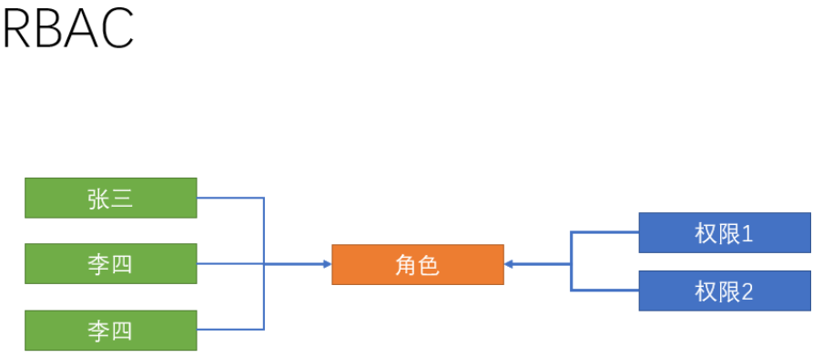
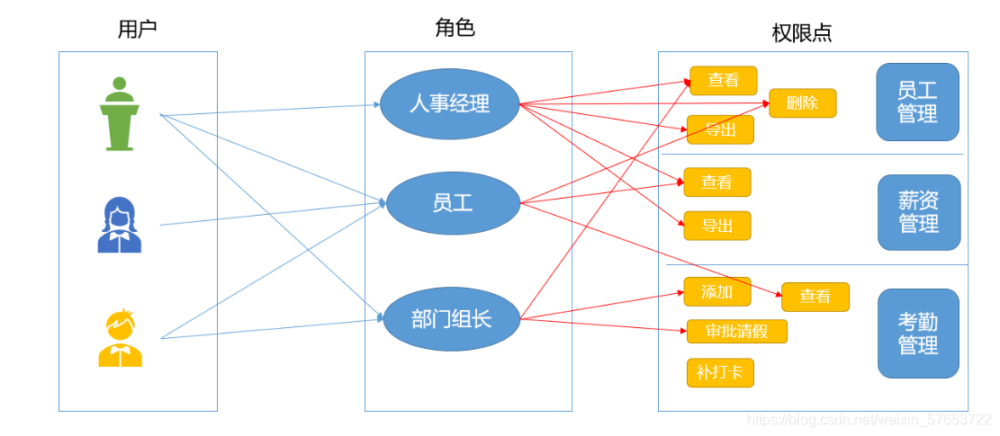
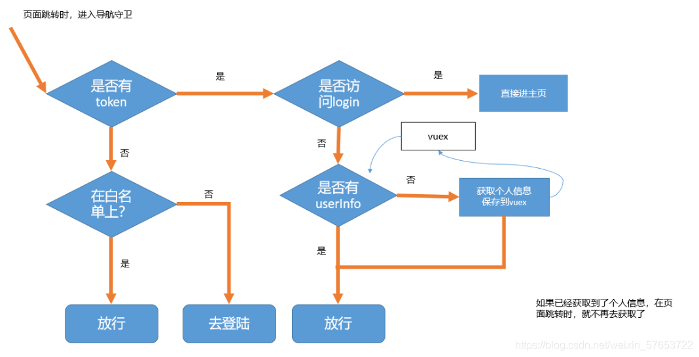
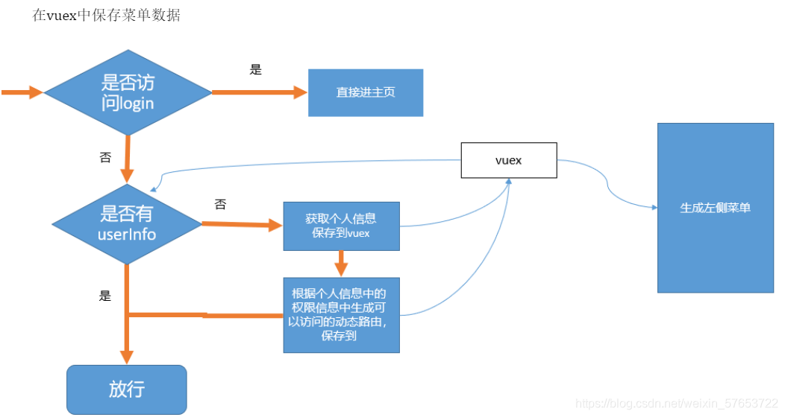
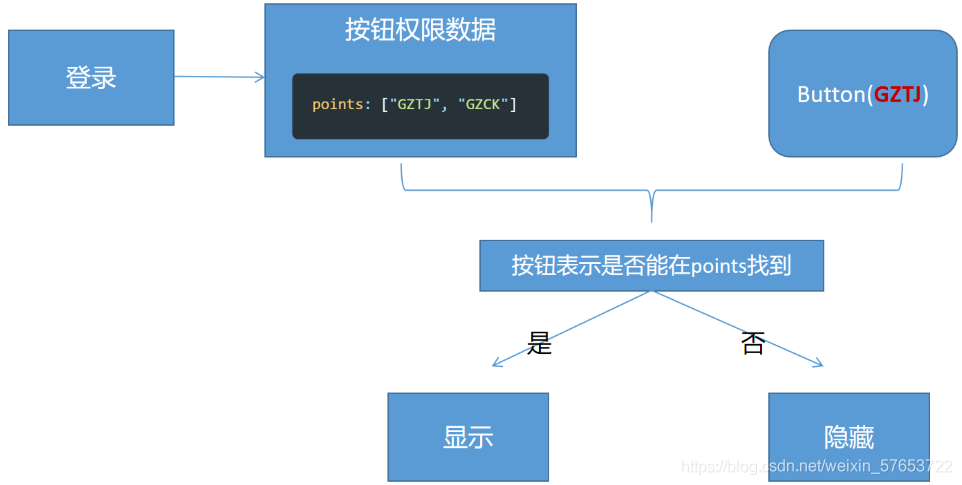

# 后台管理系统的权限控制与管理

>最近公司准备做一个新的管理后台，管理后台的权限控制肯定是必不可少的，于是调研了许多开源的后台管理系统和网上的一些资料，发现都是基于RBAC来实现权限的控制.

## 权限相关概念
### 权限的分类
+ 后端权限

从根不上讲前端仅仅只是视图层的展示， 权限的核心是在于服务器中的数据变，所以后端才是权限的关键，后端权限可以控制某个用户是否能够查询数据， 是否能够修改数据等操作。

#### 1.后端如何知道该请求是哪个用户发过来的

cookie、session、token

#### 2.后端的权限设计RBAC

用户、角色、权限

+ 前端权限

前端权限的控制本质上来说， 就是控制端的视图层的展示和前端所发送的请求。但是只有前端权限控制没有后端权限控制是万万不可的。 前端权限控制只可以说是达到锦上添花的效果。

### 前端权限的意义

如果仅从能够修改服务器中数据库中的数据层面上讲， 确实只在后端做控制就足够了， 那为什么越来越多的项目也进行了前端权限的控制， 主要有这几方面的好处

+ 降低非法操作的可能性 

不怕赃偷就怕贼惦记， 在页面中展示出一个就算点击了也最终会失败的按钮，势必会增加有心者非法操作的可能性。

+ 尽可能排除不必要清求， 减轻服务器压力 

没必要的请求， 操作失败的清求， 不具备权限的清求， 应该压根就不需要发送， 请求少了， 自然也会减轻服务器的压力。

+ 提高用户体验

根据用户具备的权限为该用户展现自己权限范围内的内容， 避免在界面上给用户带来困扰， 让用户专注于分内之事。

## 前端权限控制思路
### 1.菜单的控制
在登录请求中， 会得到权限数据， 当然， 这个需要后端返回数据的支持． 前端根据权限数据， 展示对应的菜单． 点击菜单， 才能查看相关的界面

### 2.界面的控制
如果用户没有登录， 手动在地址栏敲入管理界面的地址， 则需要跳转到登录界面
如果用户已经登录， 如果手动敲入非权限内的地址， 则需要跳转404 界面

### 3.按钮的控制
在某个菜单的界面中， 还得根据权限数据， 展示出可进行操作的按钮，比如删除， 修改， 增加

### 4.按钮的控制
如果用户通过非常规操作， 比如通过浏览器调试工具将某些禁用的按钮变成启用状态， 此时发的请求， 也应该被前端所拦截

## 实现步骤
### RBAC权限设计思想
目标:不同账号登录系统后看到不同的页面, 能执行不同的功能



三个关键点:

用户： 就是使用系统的人

权限点：这个系统中有多少个功能（例始：有3个页面，每个页面上的有不同的操作）

角色：不同的权限点的集合



实际上就是

1.给用户分配角色
2.给角色分配权限点

实际业务中:

1.先给员工分配一个具体的角色         
2.然后给角色分配具体的权限点 （工资页面 工资页面下的操作按钮）员工就拥有了权限点



### 具体步骤
#### 1.动态生成左侧菜单-addRoutes方法
```js
// 引入所有的动态路由表(未经过筛选)
import router, { asyncRoutes } from '@/router'
const whiteList = ['/login', '/404']
router.beforeEach(async(to, from, next) => {
  NProgress.start() // 启动进度条
  if (store.getters.token) {
    if (to.path === '/login') {
      next('/')
    } else {
      if (!store.getters.userId) {
        // 判断userInfo有没有id值,如果没有就进user/getUserInfo
        const menus = await store.dispatch('user/getUserInfo')
        console.log('当前用户可以访问的权限是', menus)
        // 根据用户的实际权限menus,可以在asyncRoutes筛选出用户可以访问的权限
        const filterRoute = asyncRoutes.filter(route => {
          return menus.includes(route.children[0].name)
        })
 
        // 因为404页面在路由的中间位置,要进去之前404路由后面的路由时,直接进404页面了
        // 把404路由添加到所有路由的末尾就可以解决这个问题
        filterRoute.push( // 404 page must be placed at the end !!!
          { path: '*', redirect: '/404', hidden: true })
        // 改写成动态添加路由
        // addRoutes用来动态添加路由配置
        // 只有在这里设置了补充路由配置,才能去访问页面,如果没有设置的话,左边的菜单不显示的
        router.addRoutes(filterRoute)
        // 把他们保存到vuex中,在src\layout\components\Sidebar\index.vue
        // 生成左侧菜单时,也应该去vuex中拿
        store.commit('menu/setMenuList', filterRoute)
        // 解决刷新出现的白屏bug
        next({
          ...to, // next({ ...to })的目的,是保证路由添加完了再进入页面 (可以理解为重进一次)
          replace: true // 重进一次, 不保留重复历史
        })
      } else {
        next()
      }
    }
  } else {
    if (whiteList.includes(to.path)) {
      next()
    } else {
      next('/login')
    }
  }
})
```
我们发现左侧的菜单只剩下静态的首页了，浏览器手动输入某一个动态路由地址，依旧是可用的，这证明我们其实已经把动态路由添加到我们的路由系统了。

#### 2.动态生成左侧菜单-改写菜单保存位置

当前的菜单渲染使用的数据：this.$router.options.routes 这个数据是固定，addRoutes添加的路由表只存在内存中，并不会改变this.$router.options.routes

目标:调用router.addRoutes() , 想要数据反映到视图上, 将路由信息存在vuex中



##### 2.1定义vuex管理菜单数据
在src/store/modules下补充menu.js :
```js
// 导入静态路由
import { constantRoutes } from '@/router'
export default {
  namespaced: true,
  state: {
    // 先以静态路由作为菜单数据的初始值
    menuList: [...constantRoutes]
  },
  mutations: {
    setMenuList(state, asyncRoutes) {
      // 将动态路由和静态路由组合起来
      state.menuList = [...constantRoutes, ...asyncRoutes]
    }
  }
}
```
src/store/index.js中注册这个模块

##### 2.2提交setMenuList生成完整的菜单数据

修改src/permission.js:
```js

if (!store.getters.userId) {
    await store.dispatch('user/getUserInfo')
    // 把动态路由数据交给菜单
    store.commit('menu/setMenuList', asyncRoutes)
    // 把动态路由添加到应用的路由系统里
    router.addRoutes(asyncRoutes)
}
```
##### 2.3菜单生成部分改写使用vuex中的数据
```js
routes() {
  // 拿到的是一个完整的包含了静态路由和动态路由的数据结构
  // return this.$router.options.routes
  return this.$store.state.routeMenu.menuList
}
```
#### 3.使用权限数据做过滤处理
+ 通过后台返回的权限数据, 过滤出要显示的菜单, 过滤使用路由的name作为标识
+ 从action中获取返回值 
action本质上是一个promise 它的return 结果可以通过const res = await action名来接收
+ 修改 store/modules/user.js
```js
// 用来获取用户信息的action
    async getUserInfo(context) {
      // 1. ajax获取基本信息，包含用户id
      const rs = await getUserInfoApi()
      console.log('用来获取用户信息的,', rs)
      // 2. 根据用户id（rs.data.userId）再发请求，获取详情（包含头像）
      const info = await getUserDetailById(rs.data.userId)
      console.log('获取详情', info.data)
      // 把上边获取的两份合并在一起，保存到vuex中
      context.commit('setUserInfo', { ...info.data, ...rs.data })
      return rs.data.roles.menus
    },
```
+ 在permission.js中过滤
```js
if (!store.getters.userId) {
  // 有token,要去的不是login，就直接放行
  // 进一步获取用户信息
  // 发ajax---派发action来做
  const menus = await store.dispatch('user/getUserInfo')
  console.log('当前用户能访问的页面', menus)
  console.log('当前系统功能中提供的所有的动态路由页面是', asyncRoutes)
  // 根据本用户实际的权限menus去 asyncRoutes 中做过滤，选出本用户能访问的页面

  const filterRoutes = asyncRoutes.filter(route => {
    const routeName = route.children[0].name
    return menus.includes(routeName)
  })

  // 一定要在进入主页之前去获取用户信息

  // addRoutes用来动态添加路由配置
  // 只有在这里设置了补充了路由配置，才可能去访问页面
  // 它们不会出现左侧
  router.addRoutes(filterRoutes)

  // 把它们保存在vuex中，在src\layout\components\Sidebar\index.vue
  // 生成左侧菜单时，也应该去vuex中拿
  store.commit('menu/setMenuList', filterRoutes)

  // 解决刷新出现的白屏bug
  next({
    ...to, // next({ ...to })的目的,是保证路由添加完了再进入页面 (可以理解为重进一次)
    replace: true // 重进一次, 不保留重复历史
  })
}
```
+ 注意事项
解决404问题
原因：现在我们的路由设置中的404页处在中间位置而不是所有路由的末尾了
解决办法：把404页改到路由配置的最末尾就可以了
1. 从route/index.js中的静态路由中删除path:’*'这一项
2. 在permission.js中补充在最后
```js
if (!store.getters.userId) {
  // 有token,要去的不是login，就直接放行
  // 进一步获取用户信息
  // 发ajax---派发action来做
  const menus = await store.dispatch('user/getUserInfo')
  console.log('当前用户能访问的页面', menus)
  console.log('当前系统功能中提供的所有的动态路由页面是', asyncRoutes)
  // 根据本用户实际的权限menus去 asyncRoutes 中做过滤，选出本用户能访问的页面

  const filterRoutes = asyncRoutes.filter(route => {
    const routeName = route.children[0].name
    return menus.includes(routeName)
  })

  // 一定要在进入主页之前去获取用户信息

  // 把404加到最后一条
  filterRoutes.push( // 404 page must be placed at the end !!!
    { path: '*', redirect: '/404', hidden: true })

  // addRoutes用来动态添加路由配置
  // 只有在这里设置了补充了路由配置，才可能去访问页面
  // 它们不会出现左侧
  router.addRoutes(filterRoutes)

  // 把它们保存在vuex中，在src\layout\components\Sidebar\index.vue
  // 生成左侧菜单时，也应该去vuex中拿
  store.commit('menu/setMenuList', filterRoutes)

  // 解决刷新出现的白屏bug
  next({
    ...to, // next({ ...to })的目的,是保证路由添加完了再进入页面 (可以理解为重进一次)
    replace: true // 重进一次, 不保留重复历史
  })
}
```
+ 退出时重置路由
```js
// 重置路由
export function resetRouter() {
  const newRouter = createRouter()
  router.matcher = newRouter.matcher // 重新设置路由的可匹配路径
}
```
这个方法就是将路由重新实例化，相当于换了一个新的路由，之前加的路由就不存在了，需要在登出的时候， 调用一下即可
```js
import { resetRouter } from '@/router'
// 退出的action操作
logout(context) {
  // 1. 移除vuex个人信息
  context.commit('removeUserInfo')
  // 2. 移除token信息
  context.commit('removeToken')
  // 3. 重置路由
  resetRouter()
  // 4. 重置 vuex 中的路由信息 只保留每个用户都一样的静态路由数据
  //    在moudules中的一个module中去调用另一个modules中的mutation要加{root:true}
  context.commit('setMenuList', [], { root: true })
}
```
#### 4.控制操作按钮

定义全局检测的方法:
```js
Vue.prototype.$checkPoint = function(pointKey) {
  if (store.state.user.userInfo.roles.points) {
    // 进行权限点判断
    return store.state.user.userInfo.roles.points.includes(pointKey)
  }
  // 没有权限点POINTS信息, 说明用户没有身份, 没有任何权限
  return false
}
```
在模板中通过if来控制按钮显示
```js
<template>
  <div class="dashboard-container">
    <div class="app-container">
      <el-card>
        <el-button v-if="$checkPoint('CKGZ')">查看工资</el-button>
      </el-card>
    </div>
  </div>
</template>
```
$checkPoint中的参数以系统中权限点的标识符为准。

或者自定义指令控制按钮显示

在main.js中定义全局指令

```js
// 注册一个全局自定义指令 `v-allow`
Vue.directive('allow', {
  // 当被绑定的元素插入到 DOM 中时……
  inserted: function(el, binding) {
    // v-focus="'abc'"  ===> binding.value = 'abc'
    if (store.state.user.userInfo.roles.points.includes(binding.value)) {
      // 元素是可见的
    } else {
      el.style.display = 'none'
    }
  }
})
```
使用
```js
    <el-button
      v-allow="'import_employee'"
      type="warning"
      size="small"
      @click="$router.push('/import')"
    >导入excel</el-button>
```
### 参考开源管理后台系统  
[vue-element-admin](https://panjiachen.github.io/vue-element-admin)

[boot.jeecg](http://boot.jeecg.com/user/login?redirect=%2F)

[gin-vue-admin](https://demo.gin-vue-admin.com/)

[django-vue-admin](https://demo.django-vue-admin.com/)

[若依后台管理框架](http://vue.ruoyi.vip/)

